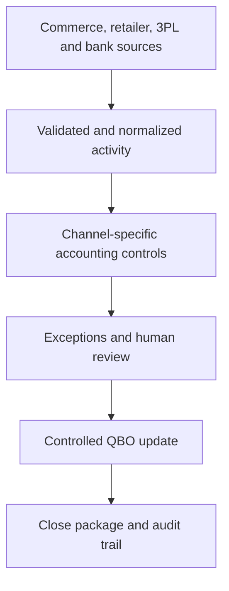

# E-Commerce Financial Operations System

> A public reference architecture for controlled, channel-aware e-commerce accounting operations.

Designed by **Delana Prudhomme**, this repository demonstrates how a financial operating system can reconcile the different economics of direct-to-consumer, marketplace, wholesale, national retail, and third-party logistics channels into one reliable month-end close.

## Why This Exists

E-commerce deposits are not revenue summaries. A single deposit can contain sales, taxes, discounts, refunds, reserves, fees, chargebacks, timing differences, and activity from multiple accounting periods.

This reference architecture shows how to preserve gross economic activity, route each channel through the correct accounting path, surface exceptions, retain human approval over judgment, and produce traceable support for QuickBooks Online.

## Business Models Covered

| Operating model | Representative channels | Primary accounting path |
|---|---|---|
| Multi-channel DTC | Shopify, Amazon, Etsy, TikTok Shop, Meta | Settlement-to-cash reconciliation |
| B2B + DTC omnichannel | Wholesale, EDI customers, Faire, Amazon, Shopify | AR and settlement routing |
| High-volume DTC + national retail | Shopify, Amazon, specialty and big-box retail | Batch controls, retailer AR, deductions, and settlements |
| CPG + DTC + 3PL | National retail, Shopify, 3PL inventory and fulfillment | Revenue, AR, inventory, COGS, and fulfillment-cost controls |

## Reference Workflows

### 01 — DTC Multi-Channel Settlement Reconciliation

Reconciles channel activity from source sales through processor or marketplace settlement, bank deposit, clearing, QBO, month-end adjustment, and audit evidence.

### 02 — B2B + DTC Omnichannel Revenue Reconciliation

Routes wholesale activity through invoice-to-remittance-to-cash controls while marketplace and DTC activity follow settlement accounting. Deductions, short pays, unapplied cash, and unsupported differences remain visible.

### 03 — High-Volume DTC + National Retail + Marketplace

Combines transaction-level batch controls with retailer AR, remittance, deductions, returns, allowances, chargebacks, marketplace settlements, and month-end cutoff review.

### 04 — CPG + Big-Box + DTC + 3PL

Connects retailer AR and Shopify settlements to 3PL inventory movement, inventory-to-QBO reconciliation, channel COGS, fulfillment costs, and gross-margin review.

## Operating Architecture

The operating model separates deterministic accounting calculations from automation orchestration and judgment:

- **Source layer:** commerce platforms, marketplaces, processors, retailer portals, 3PL systems, bank activity, and QBO
- **Normalization layer:** consistent channel, settlement, invoice, remittance, SKU, and transaction structures
- **Control layer:** settlement, AR, inventory, COGS, fee, cutoff, clearing, and duplicate controls
- **Exception layer:** unsupported activity, timing differences, missing evidence, mapping failures, and material variances
- **Review layer:** approval for write-offs, deductions, journal entries, inventory adjustments, policy decisions, and material exceptions
- **Accounting layer:** controlled QBO posting, cash application, clearing reconciliation, and month-end adjustment
- **Evidence layer:** reconciliations, rollforwards, exception resolution, approvals, and close support

## Core Accounting Principles

- Preserve gross activity instead of treating net deposits as revenue.
- Reconcile each channel through its actual economic and cash-conversion path.
- Keep settlement clearing, AR, inventory, and other variances separate.
- Roll supported uncleared settlement balances forward until cash clears.
- Preserve open AR until supported cash, credit, deduction, or approved adjustment resolves it.
- Require evidence before accepting retailer deductions or inventory adjustments.
- Tie high-volume accounting batches to transaction-level source totals.
- Attribute COGS to the correct channel or customer before relying on channel profitability.
- Route material exceptions to review instead of silently plugging the close.
- Retain traceable support for every controlled accounting update.

## What Is Public

This repository includes reference architecture, control concepts, workflow summaries, and synthetic examples intended to demonstrate system design and accounting depth.

## What Remains Private

The production repository contains the executable reconciliation engines, detailed agent specifications, orchestration scenarios, client configurations, mapping logic, thresholds, integration contracts, test suites, and reviewer outputs. Those materials are intentionally excluded from this public reference.

No client financial data, credentials, proprietary reports, or confidential contract terms are included here.

## Repository Map

- [`docs/architecture.md`](docs/architecture.md) — system layers and responsibility boundaries
- [`docs/control-framework.md`](docs/control-framework.md) — accounting, exception, and approval controls
- [`workflows/`](workflows/) — four public workflow summaries
- [`examples/synthetic-close-package.md`](examples/synthetic-close-package.md) — example structure for reviewer-ready evidence
- [`NOTICE.md`](NOTICE.md) — ownership and permitted-use notice

## Status

Public reference release covering four e-commerce operating models. The private build contains executable prototypes and expanded implementation materials.

## About Delana

Delana Prudhomme is an accounting and finance operations professional who designs customized financial operating systems that connect accounting controls, automation, AI-assisted review, and executive reporting to the way a business actually operates.
