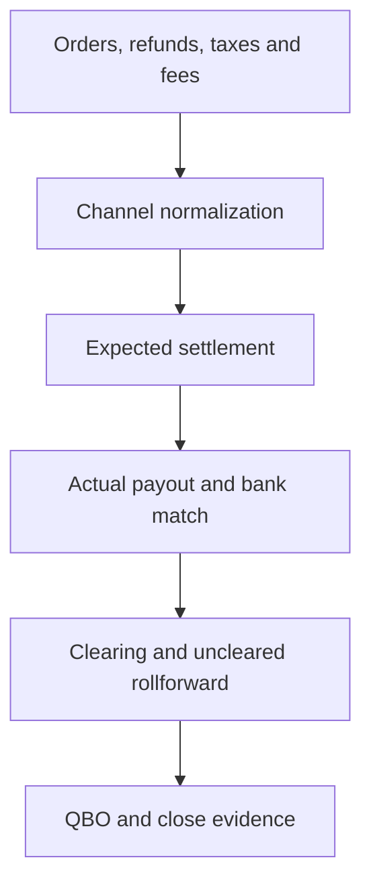

# Workflow 01 — DTC Multi-Channel Settlement Reconciliation

## Profile

A consumer brand selling through a Shopify-led environment that may also include Amazon, Etsy, TikTok Shop, Meta commerce, and multiple payment processors.

## Objective

Trace gross channel activity through settlement, cash, QBO clearing, month-end adjustment, and close evidence.

## Public Workflow

## Key Controls

- Gross-to-net settlement tie-out by channel
- Duplicate and missing-settlement detection
- Settlement-to-bank matching
- Refund and chargeback validation
- Supported uncleared-balance rollforward
- Month-end cutoff review
- Separate quantification of unexplained variance

## Human Review

Required for material unmatched settlements, manual journal entries, unusual chargebacks, mapping changes, and unresolved cutoff differences.

## Reviewer Output

Channel reconciliation, settlement rollforward, clearing tie-out, exception summary, approved adjustments, and audit evidence index.

