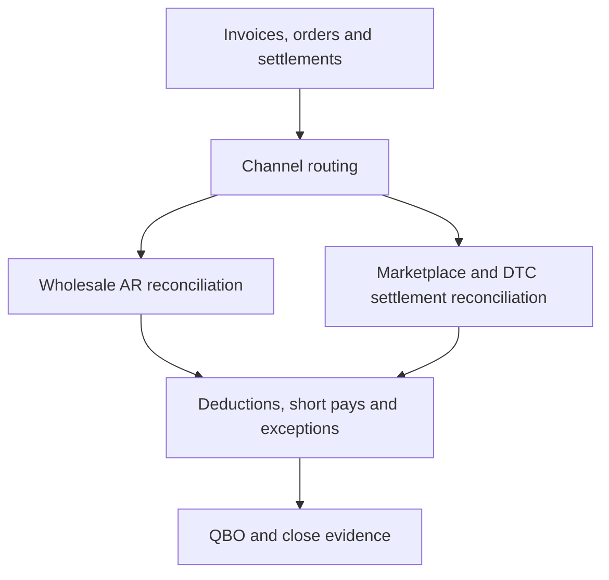

# Workflow 02 — B2B + DTC Omnichannel Revenue Reconciliation

## Profile

A business combining wholesale or EDI customers with Faire, Amazon, Shopify reseller activity, and a smaller direct-to-consumer channel.

## Objective

Route invoiced wholesale activity through AR controls and settlement-driven activity through clearing controls while producing one supported revenue and cash close.

## Public Workflow

## Key Controls

- Invoice-to-remittance-to-cash matching
- Supported versus unsupported deduction treatment
- Short-pay and remaining-AR preservation
- Unapplied-cash controls
- Gross-to-net marketplace and DTC settlement tie-outs
- Duplicate invoice and payment detection
- Month-end cutoff review

## Human Review

Required for write-offs, deduction acceptance, credits, material mapping changes, manual entries, and unresolved customer balances.

## Reviewer Output

Customer AR reconciliation, cash-application schedule, deduction register, settlement tie-out, exception queue, and close evidence index.

