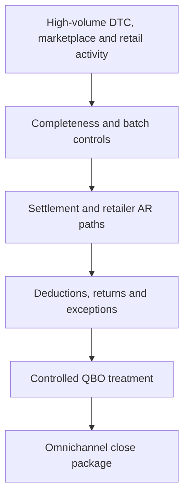

# Workflow 03 — High-Volume DTC + National Retail + Marketplace

## Profile

A scaling consumer brand with high-volume Shopify DTC, Amazon marketplace activity, and national specialty or big-box retail relationships.

## Objective

Maintain transaction-level traceability while reconciling summarized accounting batches, marketplace settlements, retailer receivables, remittances, and gross-to-net deductions.

## Public Workflow

## Key Controls

- Transaction-to-batch control totals
- Shopify and processor settlement tie-outs
- Amazon settlement reconciliation
- Retailer invoice, remittance, and cash matching
- Deduction, allowance, return, and chargeback validation
- Unapplied cash and clearing review
- Cross-period cutoff controls

## Human Review

Required for material retailer deductions, unusual allowances, write-offs, manual credits, mapping changes, manual entries, and unresolved material exceptions.

## Reviewer Output

Batch-control report, channel settlement reconciliations, retailer AR and deduction schedules, exception summary, approved adjustment schedule, and audit evidence index.

