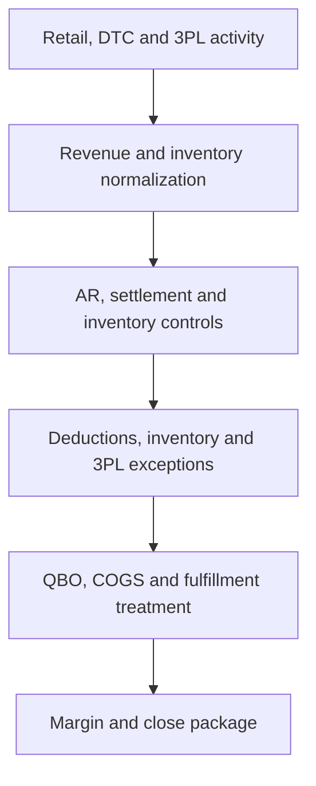

# Workflow 04 — CPG + Big-Box + DTC + 3PL

## Profile

A physical consumer-products brand selling through national retail and Shopify while a third-party logistics provider manages inventory and fulfillment.

## Objective

Connect retailer AR and DTC settlement controls to inventory movement, QBO inventory, channel COGS, fulfillment costs, and supported channel profitability.

## Public Workflow

## Key Controls

- Retailer AR, remittance, deduction, and short-pay controls
- Shopify settlement and uncleared-balance rollforward
- 3PL inventory movement and ending-balance reconciliation
- Inventory-to-QBO tie-out
- In-transit, return, damage, shrinkage, and cutoff review
- Customer and channel COGS attribution
- Storage, fulfillment, freight, and accessorial-cost classification
- Channel gross-margin and contribution support

## Human Review

Required for unsupported retailer deductions, inventory write-offs, shrinkage, material 3PL disputes, unusual cost classification, manual entries, and accounting-policy changes.

## Reviewer Output

Retailer AR and deduction schedules, Shopify settlement reconciliation, 3PL inventory rollforward, QBO inventory tie-out, COGS attribution, fulfillment-cost review, margin analysis, exception queue, and audit evidence index.

